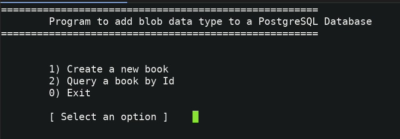
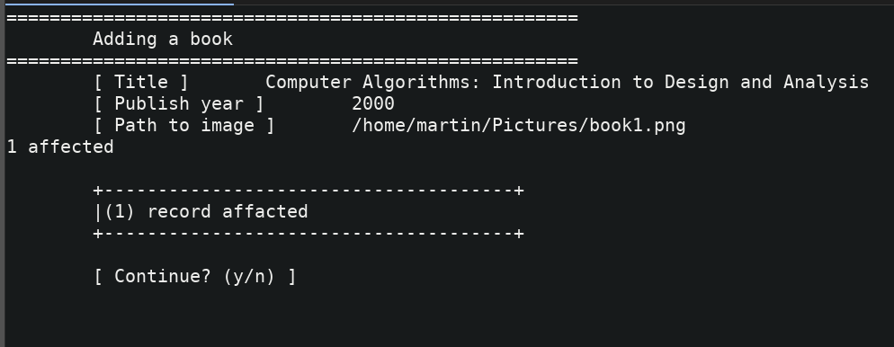
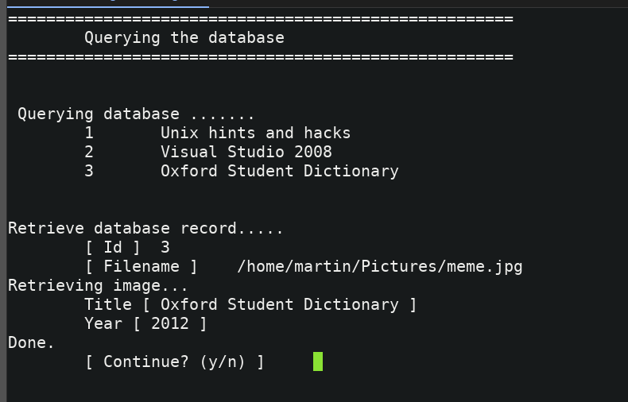
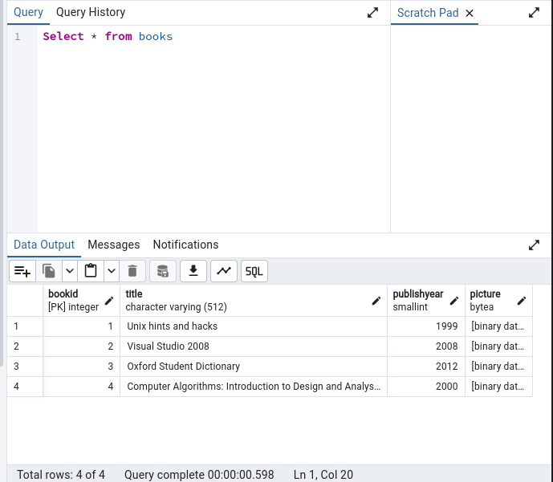

# Trabajando con Binary Large Object (BLOB) en PostgreSQL con MonoDevelop

En la actualidad existen aplicaciones que además de almacenar y procesar datos basados en caracteres, requieren también almacenar y procesar archivos de gran tamaño de tipo binario o  texto, tales archivos como los multimedia (gráficas, imágenes, audio, vídeo) o los generados por programas de oficina (documentos, presentaciones, hojas de calculo), para estos casos en el estándar SQL están definidos dos tipos de datos para guardar grandes cantidades de información: el CLOB (CHARACTER LARGE OBJECT) que se utiliza para información de tipo texto  y el BLOB (BINARY LARGE OBJECT) que se utiliza para información de tipo binario, para este último PostgreSQL proporciona dos formas de trabajar: una es mediante las funciones lo_import() y lo_export() incorporadas dentro del servidor de base de datos y la otra mediante columnas del tipo de dato bytea, que pueden ser utilizadas por las aplicaciones para el almacenamiento de archivos binarios.

<h3>Como leer y escribir objetos binarios en PostgreSQL con MonoDevelop</h3>

Para leer y escribir tipos de datos binarios de PostgreSQL con .NET, el data provider de PostgreSQL (http://npgsql.projects.pgfoundry.org/) proporciona la clase <b>NpgsqlDataReader</b>  esta clase representa un cursor rápido de solo lectura (read-only) para un recordset (conjunto de registros) obtenido de la base de datos mediante una consulta SQL, esto lo hace ideal para grandes cantidades de datos y para registros binarios de gran tamaño ya obtiene la información mediante un flujo (stream) de bytes un registro a la vez de todo el conjunto de datos, esta característica puede combinarse con un objeto <b>POCO (plain old CLR object)</b> para poder crear objetos que sean equivalentes a las entidades en la base de datos.

A continuación creamos un proyecto de consola, utilizando el lenguaje de programación C#.
Este proyecto se compone de tres clases: Main, Book y BooksManagerDAC. Main es la clase principal, Book es el objeto que representa un registro en la base de datos y  BooksManagerDAC es donde se encuentra toda la funcionalidad para la comunicación con la base de datos.

Al ejecutar la clase dentro de Monodevelop o bien desde una terminal, la aplicación realiza las siguientes acciones: solicita los datos de un libro para almacenar, muestra los registros que ya están almacenados y solicita una llave primaria o id para obtener el registro.

Ahora la explicación de las funcionalidades que se encuentran en la clase BooksManagerDAC
Mediante el método  GetPhoto() la aplicación toma un archivo del sistema de archivos y lo convierte a una matriz de bytes 

<pre>
static byte[] GetPhoto(string filename)
{
      byte[] photo = null;
      using(FileStream fis = new FileStream(filename,FileMode.Open,FileAccess.Read))
      {
           BinaryReader reader = new BinaryReader(fis);
           photo = reader.ReadBytes((int)fis.Length);
           reader.Close();
      }
      return photo;
}
</pre>

Esta matriz de bytes se pasa como parámetro al comando Insert dentro del método Create (Book b)  para enviarla hacia la base de datos. 

<pre>
byte[] bytesFromImage = GetPhoto(b.ImagePath);
var pPicture = new NpgsqlParameter("picture", NpgsqlDbType.Bytea);
pPicture.SourceColumn = "picture";
pPicture.Value = bytesFromImage;
</pre>

Al obtener el registro mediante el método  SelectById(int id,string fileName)  se utiliza el método RetrieveImage  únicamente para la columna picture en donde se convierte la matriz de bytes de la  tabla a un archivo en el sistema de archivos.

<pre>
static void RetrieveImage(NpgsqlDataReader reader
,int columnImage
,string fileName)
{
  byte[] result = (byte[])reader.GetValue(columnImage);
   using(FileStream fis = new FileStream(fileName,FileMode.OpenOrCreate,
   FileAccess.Write))
	{
        using(BinaryWriter writer = new BinaryWriter(fis))
          {
                      writer.Write(result);
                      writer.Flush();
           }
   }
}
</pre>

<strong></strong>

<strong></strong>

<strong></strong>

<strong></strong>

<h3>Conclusiones</h3>

PostgreSQL es una de las mas completas base de datos relacionales de fuente abierta (open source)  , el soporte al almacenamiento de archivos binarios hace que sea considerada como una buena alternativa de almacenamiento que combinado con las capacidades de :NET tenemos una propuesta sólida para  la construcción de aplicaciones empresariales.

